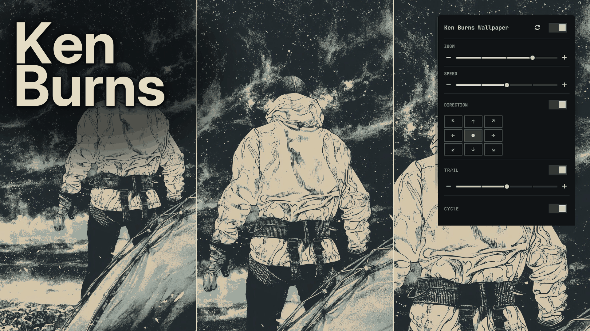
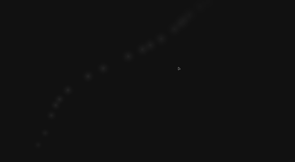

# Ken Burns Wallpaper

An [Omarchy](https://omarchy.org) plugin that paints a slow Ken Burns loop on the
current wallpaper: the image itself zooms and drifts.



The loop on the current wallpaper:



## Features

- Cosine zoom from 1× out to a chosen maximum and back, with no stop and no jump
  at the loop seam.
- Optional compass drift (eight directions or stay centred) that rides on the
  zoom margin, so the image never shows a black edge.
- Vary: pick a new heading at each seam, where the pan is already zero.
- Optional Advance: ask Omarchy for the next wallpaper when a loop finishes.
- Bar button with a settings panel. Right-click toggles the animation without
  opening the panel.
- Follows Omarchy theme wallpaper changes with the same 420 ms slanted reveal as
  the stock background.
- Click-through Wayland surface on the bottom layer, so desktop clicks still
  reach the wallpaper switcher.
- Pauses while the session is locked, a screensaver is up, or a fullscreen
  window covers the screen. About 14 fps on AC, about 8 fps on battery.
- One timer. No per-frame allocations, no extra compositor process. Images are
  decoded at the zoomed panel size, not at the wallpaper's native resolution.

## Requirements

- [Omarchy](https://omarchy.org) 4 (Quattro) with the Quickshell bar
- Hyprland (Wayland)
- `inotifywait` from `inotify-tools` (used to notice wallpaper / theme changes)

## Installation

Install with Omarchy's plugin command:

```sh
omarchy plugin add https://github.com/gsusgit/omarchy-kenburns-wallpaper.git --enable
```

This clones the plugin to
`~/.config/omarchy/plugins/io.github.gsusgit.kenburnswallpaper` (the `id` from
`manifest.json`). If you prefer to enable it later, drop `--enable` and run:

```sh
omarchy plugin enable io.github.gsusgit.kenburnswallpaper
```

Place the widget on the bar if it is not already there:

```sh
omarchy bar put io.github.gsusgit.kenburnswallpaper --section right
```

## Upgrading

```sh
omarchy plugin update io.github.gsusgit.kenburnswallpaper
```

## Removal

```sh
omarchy plugin remove io.github.gsusgit.kenburnswallpaper
```

Settings in `~/.config/omarchy/kenburnswallpaper.json` are left in place so you
can reinstall without losing your levels.

## Configuration

Settings live **outside** the plugin folder, at
`~/.config/omarchy/kenburnswallpaper.json`. The shell reloads a plugin whenever
anything inside its directory changes; writing settings there would unmap the
panel on every save.

The file is created with defaults on first run:

```json
{
  "enabled": true,
  "speed": 35,
  "maxZoom": 1.15,
  "drift": "center",
  "wander": false,
  "advance": false
}
```

| Key | Default | Range | Meaning |
|---|---|---|---|
| `enabled` | `true` | boolean | Freeze the clock; the wallpaper stays painted |
| `speed` | `35` | 10, 23, 35, 48, 60 | Seconds per full loop (smaller is faster) |
| `maxZoom` | `1.15` | 1.10, 1.15, 1.20, 1.25, 1.30 | How far the zoom opens |
| `drift` | `center` | `center`, `left`, `right`, `up`, `down`, `upLeft`, `upRight`, `downLeft`, `downRight` | Which way the image creeps while zoomed |
| `wander` | `false` | boolean | Pick a new heading at each loop seam |
| `advance` | `false` | boolean | Next Omarchy wallpaper when a loop finishes |

Hand-edited or out-of-range values are snapped to the nearest level. Unknown keys
are dropped. The panel writes through immediately: there is no Apply step.
Changing speed, zoom or drift keeps the current pose; it does not restart the
loop. A new wallpaper still starts a fresh move.

The same values are reachable from a terminal:

```sh
qs ipc call kenburnswallpaper status
qs ipc call kenburnswallpaper setSpeed 48
qs ipc call kenburnswallpaper setMaxZoom 1.20
qs ipc call kenburnswallpaper setDrift upLeft
qs ipc call kenburnswallpaper setWander true
qs ipc call kenburnswallpaper setAdvance true
qs ipc call kenburnswallpaper setEnabled false
qs ipc call kenburnswallpaper reset
```

Move the bar button:

```sh
omarchy bar move io.github.gsusgit.kenburnswallpaper --section center
```

Open or close the panel from a command:

```sh
omarchy-shell shell summon io.github.gsusgit.kenburnswallpaper '{}'
omarchy-shell shell hide io.github.gsusgit.kenburnswallpaper
```

Hover the bar icon for `Ken Burns - ON` or `Ken Burns - OFF`. Right-click the
icon to toggle the animation.

## Releases

Tagged GitHub releases match `version` in `manifest.json`. This tree is **v5.0.0**:
the plugin id, install folder, settings path, and IPC target are
`io.github.gsusgit.kenburnswallpaper` / `kenburnswallpaper`.

## License

MIT — see [LICENSE](LICENSE).
